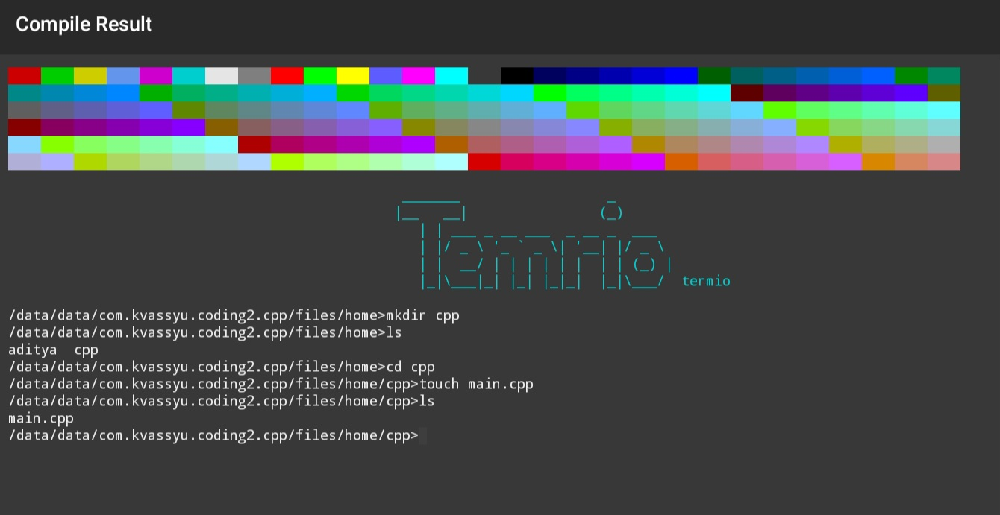

Modern & Fast Linux Shell
=========================

Overview
--------
This project introduces a fast, modern, and efficient shell designed for Linux, with an emphasis on performance, simplicity, and user experience. The shell provides seamless functionality on both Linux and Windows environments. It features support for inbuilt commands, external commands, piping, redirection, and other essential shell functionalities, making it a powerful tool for developers and users alike.





Features
--------

1.**Inbuilt Commands** ✅
- `cd`: Navigate between directories.
- `ls`: List directory contents.
- `echo`: Output text to the terminal.
- `pwd`: Print the current working directory.
- `exit`: Exit the shell.
- `cat`: Concatenate and display file contents.

Additional inbuilt commands can be added or customized.

2.**External Commands** ✅
The shell supports external commands, which are executed from the system’s PATH. Some commonly used external commands include:
- `grep`: Search for patterns within files.
- `curl`: Transfer data from or to a server.
- `man`: Display manual pages for commands.
- `python`: Execute Python scripts.
- `gcc`: Compile C programs.

3. **Piping** ✅
This shell supports piping (`|`), allowing you to pass the output of one command as the input to another. Example:
```
$ ls | grep "pattern"
```

4. **Redirection** ✅
The shell supports input and output redirection:
- Output Redirection (`>`): Directs the output of a command to a file (overwrites).
  ```
  $ echo "Hello, World!" > output.txt
  ```
- Append Redirection (`>>`): Appends the output of a command to a file.
  ```
  $ echo "More text" >> output.txt
  ```
- Input Redirection (`<`): Takes input for a command from a file.
  ```
  $ sort < unsorted.txt
  ```

5. **Cross-Platform Compatibility** ✅
This shell is designed to work on both Linux and Windows platforms. For Windows, the shell leverages compatibility layers to ensure that it functions seamlessly across both environments.

6. **Performance**✅
The shell is lightweight and optimized for performance. It provides fast execution for both simple and complex commands.

Installation
------------

Prerequisites:
- Linux: Any modern Linux distribution.
- Windows: Windows Subsystem for Linux (WSL) or a compatible terminal emulator.

Steps:
1. Clone this repository:
   ```
   git clone https://github.com/yourusername/modern-shell.git
   cd modern-shell
   ```
2. Build the shell:
   ```
   make
   ```
3. Run the shell:
   ```
   ./shell
   ```
